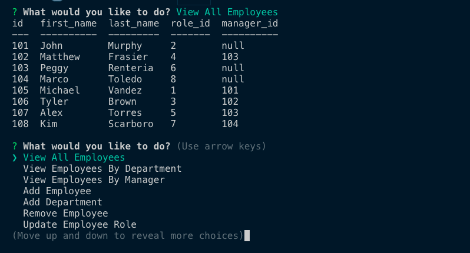

  # Company Databse

  

  ## Table of Contents

  - [Image](#image)
  - [Description](#description)
  - [Installation](#installation)
  - [License](#license)
  - [Contributors](#contributors)
  - [Contact](#contact)

  

  ## Description

  A command line application that can view and manage the departments, roles, and employees in the company.

  

  ## Installation

  In the console run
  npm install
  node server.js

  ## License

  MIT

  ## Contributors

  Jonathan Echevarria

  ## Contact:

  For questions about the Employee Database you can reach me at: 
  - [Github Profile](https://github.com/jdavila10)
  - Email j.eche589@gmail.com
  
    